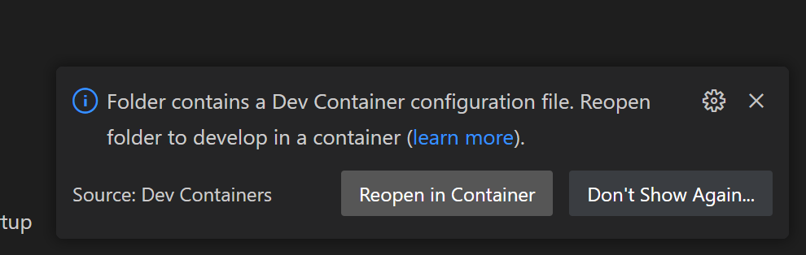

# Deploy a new App

1. Skapa ett Vercel konto (Hobby)
    1. Koppla kontot med GitHub (För att se repos, och 2fAuth)
    -> Authorize 

2. Skapa ett konto på Aiven.io
    1. Koppla kontot till GitHub
    2. Välj service 
    -> Service -> MySQL -> Free plan
    -> Namnge din db -> 'Connect'

3. Skapa ett repository på github (måste vara public)
    1. Skapa en mapp för projektet
    2. Lägg till en '.devcontainer' från ett tidigare projekt
    
    3. Öppna terminalen och skapa en koppling till ditt repo:
    -> se till att du är i rätt mapp
    
    ```bash
    git init
    git add .
    git commit -m "First commit"
    git branch -M master
    git remote add origin https://github.com/LloydElery/laravel-deploy-test.git
    git push -u origin master
    ```

4. Starta docker desktop
    1. Se till att ingen container är igång
    2. Öppna projektet i VSCode genom terminalen:
    -> Skriv följande i projektets root-mapp från terminalen
    ```bash
    code .
    ```
    3. 'Reopen in container'
    -> Klicka på knappen som poppar upp
    
    4. Se till att din container med rätt namn kör
    -> namnet matcher din root-mapp
    

5. Skapa ett Laravel-projekt
    1. Öppna en terminal i VSCode och hoppa in i rätt mapp
    ```bash
    ls
    cd exempel-namn
    ```
    2. I VSCode terminalen skriver du:
    ```bash
    composer create-project laravel/laravel exempel-namn
    ```
    3. Hoppa in i ditt nyskapade projekt.
    ```bash
    cd exempel-namn
    ```
    4. Låt projektet ladda till 100% och vänta tills att du ser det här:
    

6. Skapa en databas från VSCode terminalen
    1. Testa så att allt fungerar:
    ```bash
    cd exempel-namn
    php artisan serve
    ```
    
    2. Ändra information i .env filen
    från:
    
    till:
    
    Använd den här informationen på avien.io
    
    3. Skapa databas:
    ```bash
    php artisan migrate
    ```
    
    4. Logga in på databas och kolla så att kopplingen fungerar
    -> Använd informationen från avien och din .env fil
    
    -> server = `host`:`port`
    -> Username = `avnadmin`
    -> Password = `**************` <- ditt unika password
    -> Database = `defultdb`
    5. Nu kan du slutföra installationen på avien.io genom att klicka på 'next step' utan att fylla i information om ip och annat. Tills du kommer till:

     

    -> klicka på knappen

7. Skapa en 'api' mapp i projekt-root-mappen
    
    1. skapa en 'index.php' fil
    
    2. Klistra in följande kod i `index.php` filen
    ```php
    <?php
    // Forward Vercel requests to normal index.php
    require __DIR__ . '/../public/index.php';
    ```

8. Skapa en varcel.json fil i projekt-root-mappen
    
    -> Denna fil berättar hur vår applikation ser ut och hur dess innehåll ska presenteras
    1. Klistra in följande json kod i din fil
    ```json
        {
        "version": 2,
        "framework": null,
        "functions": {
            "api/index.php": {
                "runtime": "vercel-php@0.6.1"
            }
        },
        "routes": [
            {
                "src": "/(.*)",
                "dest": "/api/index.php"
            }
        ],
        "env": {
            "APP_ENV": "production",
            "APP_DEBUG": "true",
            "APP_URL": "https://yourproductionurl.com",
            "APP_CONFIG_CACHE": "/tmp/config.php",
            "APP_EVENTS_CACHE": "/tmp/events.php",
            "APP_PACKAGES_CACHE": "/tmp/packages.php",
            "APP_ROUTES_CACHE": "/tmp/routes.php",
            "APP_SERVICES_CACHE": "/tmp/services.php",
            "VIEW_COMPILED_PATH": "/tmp",
            "CACHE_DRIVER": "array",
            "LOG_CHANNEL": "stderr",
            "SESSION_DRIVER": "cookie"
        }
    }
    ```

9. Pusha dina ändringar
  ```bash
  git commit -m "My first deployment"
  git push
  ```

9. Deploy
    1. 'Add New Project'
    2. Välj projekt -> Repo -> Folder (App)
    3. 'Other'
    4. Output -> override -> 'api'
    5. Gör steg 10, 11 & 12 sen deploy
10. Koppla DB till projekt
    1. `php artisan key:generate` <- om det behövs
11. Redigera .env 
    1. kopiera från aiven till .env
    2. `php artisan migrate`
12. Environmental variables -> verc...
    1. Lägg till app-key från .env & Key -> Value pairs
    2. -> db connection
    3. -> db host
    4. -> db port
    5. -> username
    6. -> password
13. <- Deploy
14. Lös 'https'
    1. App -> Provider ->AppServiceProvider
    2. `boot` -> kopiera in 
    ```php
    if 
    ```